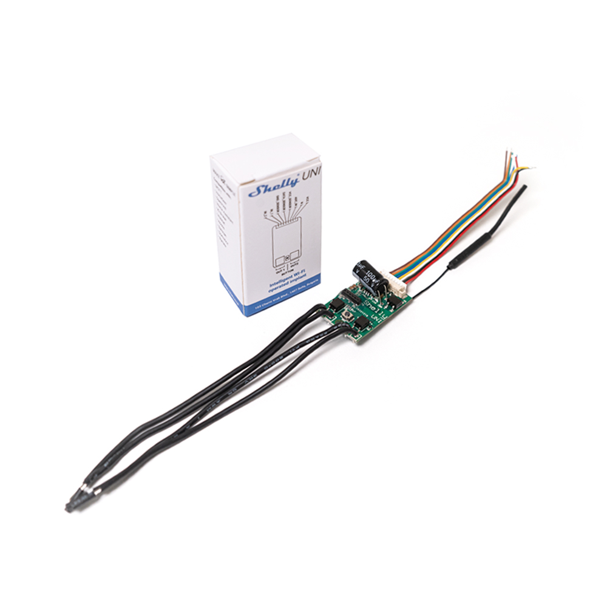
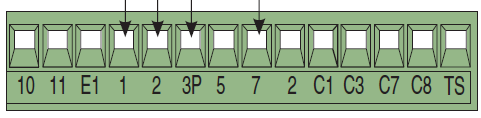
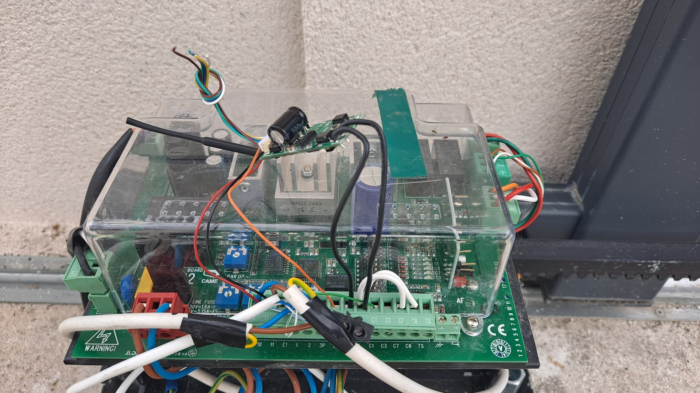

Since I built my house I want to automate everything and now it's time to start a new project, my gate.

<!--more-->

# How to do

## Hardware

So I bought a `CAME BX-243` and it does not support home automation natively.


The `CAME` brand is slightly more expensive than the others but their equipment is much more solid and qualitative.

The installation is a bit complicated when you do it for the first time, but within a few hours the gate can be opened and closed without any problems

## Time to automate

When I wanted to realize my automation I had some criteria

- Home Assistant compatibility
- Easy to use and configure
- Local polling
- Open source based
- The Smallest possible to fit in the gate box

After several hours of research, I found this amazing mod



[Shelly UNI on Amazon](https://amzn.eu/d/dJ7bBGh) - ~15€

### Wiring



| Shelly     | CAME |
| ---------- | ---- |
| VCC        | 10   |
| N          | 11   |
| IN_1       | 5    |
| OUT1 GND   | 2    |
| OUT1 AC/DC | 7    |

Like this



### How to flash it

You can use it out of the box but I want to flash it with esphome and it's easy

* Connect the device to my network
* Flash it with tasmota (https://github.com/yaourdt/mgos-to-tasmota)
* Flash it with tasmota minimal (http://ota.tasmota.com/tasmota/tasmota-minimal.bin.gz)
* Generate an esphome binary for my device like this in your home assistant ESPHome addons

```yaml
esphome:
  name: portail

esp8266:
  board: esp01_1m

# Enable logging
logger:

# Enable Home Assistant API
api:
  encryption:
    key: "your_encryptionkey"

ota:
  password: "your_password"

wifi:
  ssid: !secret wifi_ssid
  password: !secret wifi_password

  # Enable fallback hotspot (captive portal) in case wifi connection fails
  ap:
    ssid: "Portail Fallback Hotspot"
    password: "your_password"

captive_portal:

web_server:
  port: 80
  
# Input
#GPIO12 (1)
#GPIO13 (2)

# Output (Relay)
# GPIO04 (2)
# GPIO15 (1)
binary_sensor:
  - platform: gpio
    id: gate_sensor
    name: "Gate Sensor"
    pin: GPIO12
    filters:
      - delayed_on_off: 50ms
      
switch:
  - platform: gpio
    pin: GPIO15
    name: "Gate Switch"
    icon: "mdi:gate"
    id: gate_switch
    on_turn_on:
      - delay: 500ms
      - switch.turn_off: gate_switch
      
cover:
  - platform: template
    name: "Portail"
    icon: "mdi:gate"
    device_class: gate
    lambda: |-
      if (id(gate_sensor).state) {
        return COVER_CLOSED;
      } else {
        return COVER_OPEN;
      }
    open_action:
      - switch.turn_on: gate_switch
    close_action:
      - switch.turn_on: gate_switch
    stop_action:
      - switch.turn_on: gate_switch
    optimistic: true
    assumed_state: false
```

Now you can open/close the gate and know its state with your favorite home automation system.


Et voilà !