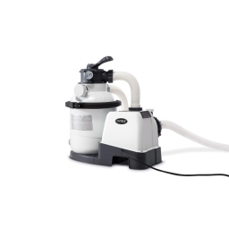

Having a pool is a good idea because previous summers have been so hot, as well as for relaxing after work, but in the other hand, it can be very useful to limit the power consumption of the pool pump motor.

<!--more-->

## Requirements

To achieve this feature, I bought 

| INTEX SX1500                | SONOFF ZBMini                       | OWON THS317-ET              |
| --------------------------- | ----------------------------------- | --------------------------- |
|  |  |  |

In my home automation I prefer to use only zigbee devices 

## Installation

> In my case, the `INTEX SX1500` cannot be triggered directly because it has a built-in scheduler, so I opened the electrical box and bypassed this feature to trigger the pool pump directly.

1) After that I wired the pump with the ZBMini, easy to do


2) I put the temperature sensor in the water and the electrinic box with the ZBMini
3) Go to `home assistant`, open `zigbee2mqtt` and pair each new device


In my case, the life of `OWON THS317-ET`battery is about 12 months

## Hassio and NodeRed

Open your home assistant instance do this :

### Helpers

Create a new [helper](https://my.home-assistant.io/redirect/helpers/) like mine


### Flow

Open Node Red and create a new flow

1) Add a cron
2) Check the current "Pool mode"
3) Get the temperaturature sensor value
4) Check if the temperature 
   * Lower than 19°
   * Between 19°and 28°
   * Greather than 28°
5) Set the delay in milliseconds and display value
6) Generate a wait for
7) Call home assistant service to start / stop the pump

You can reuse mine by importing this code

```json
[{"id":"483e9a57b37cdc8d","type":"tab","label":"Piscine","disabled":false,"info":"","env":[]},{"id":"54f86a2f80028e81","type":"api-current-state","z":"483e9a57b37cdc8d","name":"Temperature piscine","server":"c083033.86b9","version":3,"outputs":1,"halt_if":"","halt_if_type":"str","halt_if_compare":"is","entity_id":"sensor.temperature_piscine_temperature","state_type":"str","blockInputOverrides":false,"outputProperties":[{"property":"temperature","propertyType":"msg","value":"","valueType":"entityState"}],"for":"0","forType":"num","forUnits":"minutes","override_topic":false,"state_location":"payload","override_payload":"msg","entity_location":"data","override_data":"msg","x":460,"y":720,"wires":[["41106ef97c8b87d1"]]},{"id":"09e62ee1149b049d","type":"cronplus","z":"483e9a57b37cdc8d","name":"Filtration","outputField":"payload","timeZone":"","persistDynamic":false,"commandResponseMsgOutput":"output1","outputs":1,"options":[{"name":"schedule1","topic":"topic1","payloadType":"default","payload":"","expressionType":"cron","expression":"0 12,20 * * *","location":"","offset":"0","solarType":"all","solarEvents":"sunrise,sunset"}],"x":60,"y":720,"wires":[["5ba7f500dec07972"]]},{"id":"41106ef97c8b87d1","type":"switch","z":"483e9a57b37cdc8d","name":"Temps de filtration","property":"temperature","propertyType":"msg","rules":[{"t":"lt","v":"19","vt":"num"},{"t":"btwn","v":"19","vt":"num","v2":"28","v2t":"num"},{"t":"gt","v":"28","vt":"num"}],"checkall":"false","repair":false,"outputs":3,"x":730,"y":720,"wires":[["62487d3928d7818a"],["d2d4dd97d3a866d6"],["0c7a7c757d7beb72"]]},{"id":"b5e423120081925c","type":"trigger","z":"483e9a57b37cdc8d","name":"Durée traitement","op1":"on","op2":"off","op1type":"str","op2type":"str","duration":"250","extend":false,"overrideDelay":true,"units":"ms","reset":"","bytopic":"all","topic":"topic","outputs":2,"x":1250,"y":720,"wires":[["3ef0ae743e1b3881"],["6ca837267708a777"]]},{"id":"62487d3928d7818a","type":"change","z":"483e9a57b37cdc8d","name":"1h","rules":[{"t":"set","p":"delay","pt":"msg","to":"3600000","tot":"str"},{"t":"set","p":"filtration","pt":"msg","to":"1h","tot":"str"}],"action":"","property":"","from":"","to":"","reg":false,"x":990,"y":660,"wires":[["b5e423120081925c"]]},{"id":"d2d4dd97d3a866d6","type":"change","z":"483e9a57b37cdc8d","name":"1h30","rules":[{"t":"set","p":"delay","pt":"msg","to":"5400000","tot":"str"},{"t":"set","p":"filtration","pt":"msg","to":"1h30","tot":"str"}],"action":"","property":"","from":"","to":"","reg":false,"x":990,"y":720,"wires":[["b5e423120081925c"]]},{"id":"0c7a7c757d7beb72","type":"change","z":"483e9a57b37cdc8d","name":"2h","rules":[{"t":"set","p":"delay","pt":"msg","to":"7200000","tot":"str"},{"t":"set","p":"filtration","pt":"msg","to":"2h","tot":"str"}],"action":"","property":"","from":"","to":"","reg":false,"x":990,"y":780,"wires":[["b5e423120081925c"]]},{"id":"3ef0ae743e1b3881","type":"api-call-service","z":"483e9a57b37cdc8d","name":"Allumer piscine","server":"c083033.86b9","version":5,"debugenabled":false,"domain":"switch","service":"turn_on","areaId":[],"deviceId":[],"entityId":["switch.switch_piscine"],"data":"","dataType":"jsonata","mergeContext":"","mustacheAltTags":false,"outputProperties":[{"property":"message","propertyType":"msg","value":"Allumée","valueType":"str"}],"queue":"none","x":1520,"y":660,"wires":[["7de9d7c35046f82d"]]},{"id":"7de9d7c35046f82d","type":"ha-wait-until","z":"483e9a57b37cdc8d","name":"Wait on or retry","server":"c083033.86b9","version":2,"outputs":2,"entityId":"switch.switch_piscine","entityIdFilterType":"exact","property":"state","comparator":"is","value":"on","valueType":"str","timeout":"1","timeoutType":"num","timeoutUnits":"minutes","checkCurrentState":true,"blockInputOverrides":true,"outputProperties":[],"x":1520,"y":620,"wires":[["e82f89371205d55a"],["3ef0ae743e1b3881"]]},{"id":"6ca837267708a777","type":"api-call-service","z":"483e9a57b37cdc8d","name":"Eteindre piscine","server":"c083033.86b9","version":5,"debugenabled":false,"domain":"switch","service":"turn_off","areaId":[],"deviceId":[],"entityId":["switch.switch_piscine"],"data":"","dataType":"jsonata","mergeContext":"","mustacheAltTags":false,"outputProperties":[{"property":"message","propertyType":"msg","value":"Eteinte","valueType":"str"}],"queue":"none","x":1520,"y":780,"wires":[["2e25dea1e10644d6"]]},{"id":"2e25dea1e10644d6","type":"ha-wait-until","z":"483e9a57b37cdc8d","name":"Wait off or retry","server":"c083033.86b9","version":2,"outputs":2,"entityId":"switch.switch_piscine","entityIdFilterType":"exact","property":"state","comparator":"is","value":"off","valueType":"str","timeout":"1","timeoutType":"num","timeoutUnits":"minutes","checkCurrentState":true,"blockInputOverrides":true,"outputProperties":[],"x":1520,"y":820,"wires":[["e82f89371205d55a"],["6ca837267708a777"]]},{"id":"5ba7f500dec07972","type":"api-current-state","z":"483e9a57b37cdc8d","name":"Mode piscine","server":"c083033.86b9","version":3,"outputs":2,"halt_if":"Normal","halt_if_type":"str","halt_if_compare":"is","entity_id":"input_select.mode_piscine","state_type":"str","blockInputOverrides":false,"outputProperties":[{"property":"mode","propertyType":"msg","value":"","valueType":"entityState"}],"for":"0","forType":"num","forUnits":"minutes","override_topic":false,"state_location":"payload","override_payload":"msg","entity_location":"data","override_data":"msg","x":230,"y":720,"wires":[["54f86a2f80028e81"],[]]},{"id":"b5bb7276d000536a","type":"server-state-changed","z":"483e9a57b37cdc8d","name":"Mode continu","server":"c083033.86b9","version":4,"exposeToHomeAssistant":false,"haConfig":[{"property":"name","value":""},{"property":"icon","value":""}],"entityidfilter":"input_select.mode_piscine","entityidfiltertype":"exact","outputinitially":false,"state_type":"str","haltifstate":"Continu","halt_if_type":"str","halt_if_compare":"is","outputs":2,"output_only_on_state_change":true,"for":"0","forType":"num","forUnits":"minutes","ignorePrevStateNull":false,"ignorePrevStateUnknown":false,"ignorePrevStateUnavailable":false,"ignoreCurrentStateUnknown":false,"ignoreCurrentStateUnavailable":false,"outputProperties":[],"x":130,"y":860,"wires":[["9a74a6afbea67721"],["9e74d356eeff4c52"]]},{"id":"9a74a6afbea67721","type":"api-call-service","z":"483e9a57b37cdc8d","name":"Allumer piscine","server":"c083033.86b9","version":5,"debugenabled":false,"domain":"switch","service":"turn_on","areaId":[],"deviceId":[],"entityId":["switch.switch_piscine"],"data":"","dataType":"jsonata","mergeContext":"","mustacheAltTags":false,"outputProperties":[{"property":"message","propertyType":"msg","value":"Allumée","valueType":"str"}],"queue":"none","x":380,"y":840,"wires":[[]]},{"id":"9e74d356eeff4c52","type":"api-call-service","z":"483e9a57b37cdc8d","name":"Eteindre piscine","server":"c083033.86b9","version":5,"debugenabled":false,"domain":"switch","service":"turn_off","areaId":[],"deviceId":[],"entityId":["switch.switch_piscine"],"data":"","dataType":"jsonata","mergeContext":"","mustacheAltTags":false,"outputProperties":[{"property":"message","propertyType":"msg","value":"Eteinte","valueType":"str"}],"queue":"none","x":380,"y":900,"wires":[[]]},{"id":"e82f89371205d55a","type":"ha-sensor","z":"483e9a57b37cdc8d","name":"Filtration piscine","entityConfig":"ca7e7d1218501982","version":0,"state":"","stateType":"date","attributes":[{"property":"temperature","value":"temperature","valueType":"msg"},{"property":"duration","value":"filtration","valueType":"msg"},{"property":"last_start","value":"","valueType":"date"},{"property":"last_stop","value":"","valueType":"date"}],"inputOverride":"allow","outputProperties":[],"x":1780,"y":720,"wires":[[]]},{"id":"c083033.86b9","type":"server","name":"Home Assistant","version":5,"addon":true,"rejectUnauthorizedCerts":true,"ha_boolean":"y|yes|true|on|home|open","connectionDelay":true,"cacheJson":true,"heartbeat":false,"heartbeatInterval":30,"areaSelector":"friendlyName","deviceSelector":"friendlyName","entitySelector":"friendlyName","statusSeparator":"at: ","statusYear":"hidden","statusMonth":"short","statusDay":"numeric","statusHourCycle":"h23","statusTimeFormat":"h:m","enableGlobalContextStore":true},{"id":"ca7e7d1218501982","type":"ha-entity-config","server":"c083033.86b9","deviceConfig":"","name":"sensor config for Filtration piscine","version":6,"entityType":"sensor","haConfig":[{"property":"name","value":"filtration_piscine"},{"property":"device_class","value":""},{"property":"icon","value":""},{"property":"unit_of_measurement","value":""},{"property":"state_class","value":""},{"property":"last_reset","value":""}],"resend":true}]
```
And now you have a flow like this


### Hassio

In home assistant you can create a dashboard like this now


Et voilà, now it's time to swim and save your money :smile: