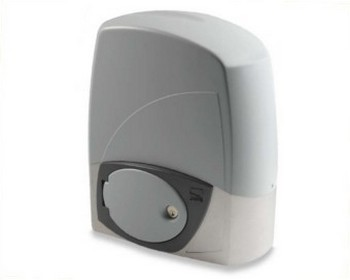
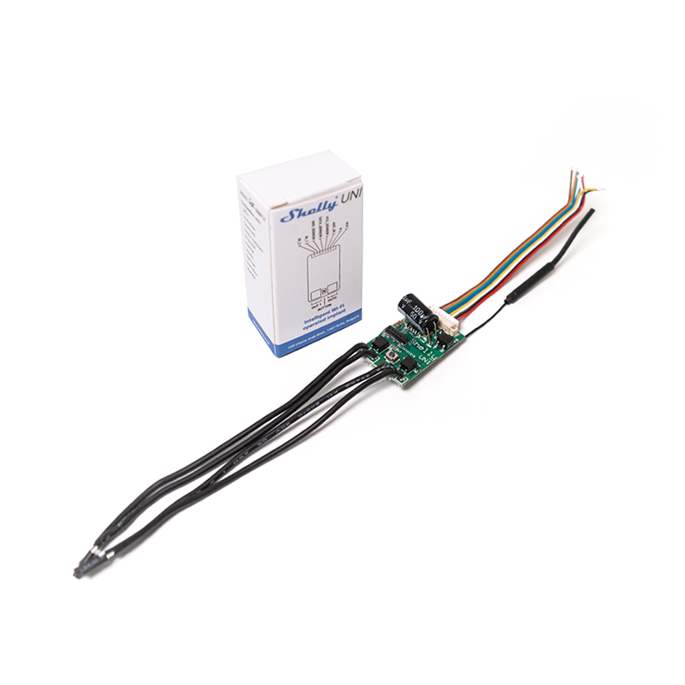

Since building my house, I've been passionate about automating everything. Today, I'm excited to share my latest project: automating my gate.

<!--more-->

# Implementation Guide

## Hardware Selection

I chose the `CAME BX-243` gate opener, which doesn't support home automation natively.



While CAME products are slightly more expensive than alternatives, their equipment is known for superior build quality and reliability.

The installation process can be challenging for first-timers, but with proper attention to detail, you can have your gate fully operational within a few hours.

## Automation Requirements

When planning the automation, I established several key criteria:

- Home Assistant compatibility
- User-friendly configuration
- Local operation (no cloud dependency)
- Open-source based solution
- Compact size to fit within the gate control box

After extensive research, I discovered the perfect solution:



[Shelly UNI on Amazon](https://amzn.eu/d/dJ7bBGh) - ~15€

### Wiring Configuration


| Shelly     | CAME |
| ---------- | ---- |
| VCC        | 10   |
| N          | 11   |
| IN_1       | 5    |
| OUT1 GND   | 2    |
| OUT1 AC/DC | 7    |

Final installation:


### Firmware Installation

While the device works out of the box, I chose to flash it with ESPHome for better integration. Here's the process:

1. Connect the device to your network
2. Flash with Tasmota using [mgos-to-tasmota](https://github.com/yaourdt/mgos-to-tasmota)
3. Flash with Tasmota minimal firmware (http://ota.tasmota.com/tasmota/tasmota-minimal.bin.gz)
4. Generate an ESPHome binary using the following configuration in your Home Assistant ESPHome addon:

```yaml
esphome:
  name: portail

esp8266:
  board: esp01_1m

# Enable logging
logger:

# Enable Home Assistant API
api:
  encryption:
    key: "your_encryptionkey"

ota:
  password: "your_password"

wifi:
  ssid: !secret wifi_ssid
  password: !secret wifi_password

  # Enable fallback hotspot (captive portal) in case wifi connection fails
  ap:
    ssid: "Portail Fallback Hotspot"
    password: "your_password"

captive_portal:

web_server:
  port: 80
  
# Input
#GPIO12 (1)
#GPIO13 (2)

# Output (Relay)
# GPIO04 (2)
# GPIO15 (1)
binary_sensor:
  - platform: gpio
    id: gate_sensor
    name: "Gate Sensor"
    pin: GPIO12
    filters:
      - delayed_on_off: 50ms
      
switch:
  - platform: gpio
    pin: GPIO15
    name: "Gate Switch"
    icon: "mdi:gate"
    id: gate_switch
    on_turn_on:
      - delay: 500ms
      - switch.turn_off: gate_switch
      
cover:
  - platform: template
    name: "Portail"
    icon: "mdi:gate"
    device_class: gate
    lambda: |-
      if (id(gate_sensor).state) {
        return COVER_CLOSED;
      } else {
        return COVER_OPEN;
      }
    open_action:
      - switch.turn_on: gate_switch
    close_action:
      - switch.turn_on: gate_switch
    stop_action:
      - switch.turn_on: gate_switch
    optimistic: true
    assumed_state: false
```

With this setup, you can now control your gate and monitor its status through your preferred home automation system.


That's it! Your gate is now fully automated and integrated with Home Assistant.